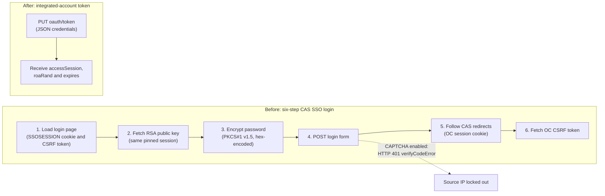

# ManageOne OC Authentication Lockout: Incident, Root Cause and Redesign of a Prometheus Exporter Login Path

An Incident report on a custom Prometheus exporter that scrapes PostgreSQL RDS fleet metrics from a Huawei ManageOne Operation Center (OC), the authentication outage that a platform upgrade caused, and the redesign that replaced a reverse-engineered browser login with the vendor's documented token endpoint.

## Table of Contents

- [Overview](#overview)
- [Real-World Business Value](#real-world-business-value)
- [Skills Demonstrated](#skills-demonstrated)
- [Project Folder Structure](#project-folder-structure)
- [Tasks and Implementation Steps](#tasks-and-implementation-steps)
- [Core Implementation Breakdown](#core-implementation-breakdown)
- [IAM Role and Permissions](#iam-role-and-permissions)
- [Project Features (Detailed Breakdown)](#project-features-detailed-breakdown)
- [Design Decisions and Highlights](#design-decisions-and-highlights)
- [Local Testing and Validation](#local-testing-and-validation)
- [Errors Encountered and Resolved](#errors-encountered-and-resolved)
- [Conclusion](#conclusion)

## Overview

A custom Python exporter authenticates to a Huawei ManageOne Operation Center, discovers every PostgreSQL RDS node from the OC configuration management database (CMDB), queries the monitoring API for host-level metrics, and exposes the results as Prometheus gauges. Prometheus scrapes the exporter, Grafana renders the dashboards, and Alertmanager routes alerts to a Microsoft Teams channel. The platform serves a fleet of approximately 140 RDS nodes in a regulated banking environment.

On 22 September 2026 a platform upgrade enabled CAPTCHA anti-brute-force protection on the OC single sign-on (SSO) login endpoint. The exporter had authenticated for months by replaying the browser login flow, which has no way to answer a CAPTCHA. Every programmatic login began to fail, the RDS fleet went dark in Prometheus and Grafana, and a Terraform plan that shared the same login path and source IP failed at the same time. This repository documents the incident, the two layers of root cause, the temporary workaround, the permanent redesign onto the vendor's documented integrated-account token endpoint, and the read-only diagnostic probes used to validate the fix without touching production.

| Field                | Value                                                                                                                                                    |
| -------------------- | -------------------------------------------------------------------------------------------------------------------------------------------------------- |
| Component            | `oc_exporter.py`, a custom Python Prometheus exporter                                                                                                    |
| Host                 | ECS bastion (`<bastion-ip>`), CentOS, Python 3.6.8, systemd service on port 9199                                                                         |
| Trigger              | Platform upgrade on 2026-09-22 that enabled CAPTCHA on the OC SSO login endpoint                                                                         |
| Symptom              | Every programmatic login returned `HTTP 401 {"error":{"type":"verifyCodeError"}}`; the whole bastion source IP was locked out                            |
| Blast radius         | Loss of RDS fleet metrics, plus a Terraform plan that shared the same login path                                                                         |
| Immediate workaround | Operator-supplied browser session cookie installed on the bastion as a header file                                                                       |
| Permanent fix        | Switched from the reverse-engineered CAS SSO password flow to the vendor's documented integrated-account token endpoint, which never touches the CAPTCHA |
| Status               | Resolved. The SSO password login is retained only as a fallback behind exponential backoff                                                               |

**Scope boundaries.** In scope: the exporter's authentication path, the incident and its diagnosis, the redesign, and the diagnostic probes. Out of scope: the metric collection logic, dashboard definitions and alert rules, which are documented in the companion repository [`prometheus-grafana-managed-rds-observability`](https://github.com/JThomas404/prometheus-grafana-managed-rds-observability), and the Terraform policy-as-code stacks, which appear here only as a second victim of the shared lockout.

**A design constraint that matters for this incident.** Only one process on the bastion is allowed to log in to OC SSO. The CAPTCHA lockout is scoped to the source IP address, so several processes authenticating from the same bastion would trip the lockout for each other. The exporter is therefore the single authenticator, and it writes a local inventory cache that other bastion processes read instead of logging in themselves.

## Real-World Business Value

- **Fleet-wide visibility was restored.** The RDS fleet of approximately 140 nodes had gone dark in Prometheus and Grafana. The temporary cookie handoff restored discovery within the incident, and the integrated-account token path removed the dependency on the CAPTCHA-protected login for good.
- **A fragile dependency was replaced with a supported one.** The original flow relied on page structure, node affinity and the absence of a CAPTCHA, all reverse-engineered from console JavaScript. A documented token API is far more likely to survive the next platform upgrade.
- **Collateral damage was contained.** The lockout was keyed on the source IP, so it affected unrelated workloads and interactive operators on the same bastion. The redesign gives each account exactly one authentication method and keeps a single SSO authenticator per IP.
- **A recoverable failure can no longer become self-sustaining.** The exporter retried on every 401, which kept re-tripping the lockout. Exponential backoff on the login path (60, 120, 300 and then 600 seconds) turns a bad state into a bounded, observable one.
- **Authentication health is now measurable.** Failure counts, consecutive failures, the current backoff and the last success time are exposed as Prometheus metrics, so a stuck login is visible on a dashboard instead of being discovered when the data disappears.
- **The investigation is reproducible.** The probes are read-only, report only status codes, header names and JSON key names, and can be re-run after the next upgrade to confirm the contract still holds.

## Skills Demonstrated

- **Protocol reverse engineering.** Reproducing a six-step CAS single sign-on flow, including RSA password encryption, CSRF token extraction, cookie pinning to an authentication node and a nested, double-encoded redirect chain, from browser JavaScript.
- **Incident diagnosis with discriminating observations.** Using a small set of single-shot probes to separate "the credentials or cryptography are wrong" from "a server policy is blocking a valid request", and proving that the policy was scoped to the source IP rather than to the account.
- **Root-cause analysis across two layers.** Distinguishing the primary cause (an IP-scoped CAPTCHA policy) from the contributing cause (a programmatic-only account being forced through SSO, which generated guaranteed failures and locked out the legitimate account).
- **Defensive authentication client design.** A fresh cookie jar per attempt, explicit method selection, error classification from non-secret response bodies, bounded exponential backoff, and strict validation of every field in a token response.
- **API migration planning.** Replacing a reverse-engineered flow with a documented vendor endpoint, with a downstream read to prove the token works before reporting success.
- **Secure tooling practice.** Credentials read from the environment or a no-echo prompt, cookie values never logged, probes that print metadata only, and a strict character allowlist on a value interpolated into a URL path.
- **Observability of the monitoring system itself.** Instrumenting authentication success, failure, backoff and recency as Prometheus metrics.
- **Blameless incident writing.** Recording the incident, the discriminators and the lessons in a form the next engineer can act on.

## Project Folder Structure

```
tools/hcs-recon/                           # Read-only diagnostic scripts used in this case study
├── SSO-LOCKOUT-CASE-STUDY.md              # The original case study this README is built from
├── oc_auth_test.py                        # Standalone test of the original six-step SSO flow
├── oc_integrated_auth_probe.py            # Tests the integrated-account token endpoint
├── oc_northbound_client.py                # Minimal northbound API client for integrated accounts
├── oc_integrated_perf_probe.py            # Sweeps the relocated performance-metrics API paths
├── oc_find_metric_api.py                  # Path discovery for the relocated metrics API
├── oc_thirdparty_contract_probe.py        # Contract validation probe
├── probe.py                               # Separate HCS IAM reconnaissance tool
└── recon-report.md                        # Probe output

<infra-repo>/5-vdc-shared/0-dev/oc-exporter/
├── oc_exporter.py                         # The exporter (approximately 4,300 lines); auth lives in OCSession
├── oc-exporter.service                    # Hardened systemd unit template, secrets substituted at deploy time
└── README.md                              # Architecture, metrics, deployment and troubleshooting
```

This repository is intentionally documentation-only. The source files listed above are not included; the sections of `oc_exporter.py` that matter to this incident, and the three probe and client scripts, are reproduced inline in [Core Implementation Breakdown](#core-implementation-breakdown) with redactions applied.

## Tasks and Implementation Steps

1. **Reverse-engineered the original SSO login.** There was no published non-interactive API at the time, so the six-step CAS flow was reproduced from the console JavaScript and first proven in a standalone script before being built into the exporter. Artefacts: `oc_auth_test.py` and the `OCSession` class in `oc_exporter.py`.
2. **Fixed the single-authenticator rule.** Because the lockout is scoped to the source IP, the exporter became the only process that logs in, and it publishes an inventory cache for everything else on the bastion. This kept one IP from competing with itself.
3. **Detected the outage.** After the upgrade, every login returned `HTTP 401 verifyCodeError`, the RDS series disappeared from Prometheus and Grafana, and a Terraform plan that performs a console login check failed with `MOVDC login failed after retry`.
4. **Separated the primary and contributing causes.** The upgrade enabled an IP-scoped CAPTCHA policy (primary). The audit-collector path was also pushing a programmatic-only account through SSO from the same IP, generating guaranteed failures that locked out the legitimate account (contributing).
5. **Isolated the cause with single-shot discriminators.** At most one probe was run before reasoning, because every extra failed attempt lengthens the lockout. The decisive result was that an off-bastion test returned `401` while the bastion returned `500`, which proved an IP-scoped policy rather than a bad password or broken code.
6. **Applied a temporary workaround.** An operator completed the CAPTCHA once in a browser that egressed through the bastion IP, copied the session `Cookie` header and installed it on the bastion as a mode-600 file, which restored RDS discovery while the permanent path was built.
7. **Validated the vendor's documented token endpoint.** The vendor confirmed a non-interactive integrated-account OAuth token endpoint that bypasses the CAPTCHA-protected login. A read-only probe exchanged a password for a token and made one CMDB read to prove the token is accepted downstream. Artefact: `oc_integrated_auth_probe.py`.
8. **Rebuilt the exporter's authentication.** Added an explicit integrated mode, separated account types so each account uses exactly one method, gated the audit collector off by default, and added exponential backoff to the SSO fallback. Artefact: `oc_exporter.py`.
9. **Wrote a reusable northbound client.** A small client for the integrated-account token flow, with strict response validation and an input allowlist, for other tooling that needs the same transport. Artefact: `oc_northbound_client.py`.
10. **Probed the relocated performance API.** The upgrade also moved the metrics API, so a probe sweeps candidate hosts, paths and header styles. Artefacts: `oc_integrated_perf_probe.py` and `oc_find_metric_api.py`.
11. **Recorded the case study.** The incident, the discriminators and the lessons were written down so the next upgrade starts from evidence rather than recollection. Artefact: `SSO-LOCKOUT-CASE-STUDY.md`.

## Core Implementation Breakdown

### Before and after

The original login was a six-step CAS single sign-on flow that had to avoid the CAPTCHA by never failing. The redesign collapses it to a single JSON request to a documented endpoint.



### Session setup and login dispatch

The session object holds the connection targets, the session state and the backoff state. In integrated mode it builds a TLS context that verifies certificates against a supplied CA bundle; only the legacy SSO mode uses the unverified context for the internally signed private cloud. The dispatcher selects the method explicitly from configuration and turns any failure into a counted, backed-off, observable event.

```python
# Create an unverified TLS context for the legacy SSO path, because the private cloud uses an internally signed CA.
ssl_ctx = ssl.create_default_context()
ssl_ctx.check_hostname = False
ssl_ctx.verify_mode = ssl.CERT_NONE


class OCSession:
    # Nested, URL-encoded redirect chain: SSO login, then CAS ticket, then OC auth, then OC dashboard (hosts redacted).
    SERVICE_URL = (
        "https%3A%2F%2F<sso-host>%2Fmounisso%2Fv1%2Foc%2Fcas%2Flogin"
        "%3Fservice%3Dhttps%253A%252F%252F<oc-host>%253A31943"
        "%252Funisess%252Fv1%252Fauth%253Fservice%253D%25252F"
        "mounionoperationwebsite%25252Findex.html"
        "%26decision%3D1%26uni_locale%3Den-us%26locale%3Den-us"
    )

    def __init__(self, oc_host, sso_host, username, password, api_token=None,
                 auth_mode="sso", integrated_auth_host=None, ca_bundle=None):
        # Store the connection targets and the account used for login.
        self.oc_host = oc_host
        self.sso_host = sso_host
        self.username = username
        self.password = password
        self.api_token = api_token
        self.auth_mode = auth_mode
        self.integrated_auth_host = integrated_auth_host
        # Track the integrated-account token, its nonce and its expiry time.
        self.access_session = ""
        self.roa_rand = ""
        self.token_expires_at = 0
        # Verify certificates against a CA bundle in integrated mode, and use the unverified context otherwise.
        self.cookie_jar = CookieJar()
        context = (ssl.create_default_context(cafile=ca_bundle or None)
                   if auth_mode == "integrated" else ssl_ctx)
        self.opener = build_opener(HTTPCookieProcessor(self.cookie_jar), HTTPSHandler(context=context))
        # Track legacy session state and the authentication backoff state.
        self.bspsession = ""
        self.csrf_token = ""
        self.authenticated = False
        self.auth_time = 0
        self.consecutive_auth_failures = 0
        self.next_auth_attempt = 0

    def login(self):
        # Select the authentication method explicitly from configuration, never by trial and error.
        try:
            if self.auth_mode == "integrated":
                return self._login_with_integrated_account()
            elif self.auth_mode == "sso" and self.api_token:
                return self._login_with_token()
            elif self.auth_mode == "sso":
                return self._login_with_sso()
            raise ValueError("Unsupported OC_AUTH_MODE")
        except Exception as e:
            # Count the failure and schedule the next permitted attempt using exponential backoff.
            self.consecutive_auth_failures += 1
            backoff = self._calc_backoff()
            self.next_auth_attempt = time.time() + backoff
            self.authenticated = False
            # Publish the failure state as Prometheus metrics so a stuck login is visible.
            oc_auth_failures_total.inc()
            oc_auth_consecutive_failures.set(self.consecutive_auth_failures)
            oc_auth_backoff_seconds.set(backoff)
            # Log the failure type and the wait before the next attempt.
            log.error("Authentication failed (attempt %d / %s): %s, backing off %ds",
                      self.consecutive_auth_failures, type(e).__name__, str(e), backoff)
            # Escalate loudly every 100 consecutive failures so a human is pulled in.
            if self.consecutive_auth_failures % 100 == 0:
                log.critical("ALERT: %d consecutive authentication failures. Manual intervention required.",
                             self.consecutive_auth_failures)
            return False
```

### The original six-step SSO flow (abridged)

The login loads the page first so that the `SSOSESSION` cookie pins the client to one authentication node, and only then fetches the RSA public key on that same pinned session. The keypair is node-affine on the multi-node cluster, so a password encrypted with one node's key cannot be decrypted by another node. The ordering is what keeps the login reliable.

```python
    def _login_with_sso(self):
        # Start every attempt with a fresh cookie jar, because stale SSOSESSION cookies cause a CAPTCHA page with no CSRF token.
        self.cookie_jar = CookieJar()
        self.opener = build_opener(HTTPCookieProcessor(self.cookie_jar), HTTPSHandler(context=ssl_ctx))
        # Step 1: load the login page so the SSOSESSION cookie pins the client to one node and yields the CSRF token.
        login_csrf = self._fetch_login_csrf()
        # Step 2: fetch the RSA public key on the pinned session, because the keypair is node-affine.
        pubkey_pem = self._fetch_pubkey()
        # Step 3: encrypt the password with the browser's RSA PKCS#1 v1.5 scheme and hex-encode it.
        encrypted_hex = self._encrypt_password(pubkey_pem)
        # Step 4: submit the login form and receive the CAS target URL.
        target_url = self._submit_login(login_csrf, encrypted_hex)
        # Step 5: follow the CAS redirect chain to collect the OC session cookie.
        self._follow_cas_redirects(target_url)
        # Step 6: fetch the OC CSRF token needed for later POST requests.
        self._fetch_oc_csrf()
        # Mark the session authenticated and reset the failure and backoff state.
        self.authenticated = True
        self.auth_time = time.time()
        self.consecutive_auth_failures = 0
        self.next_auth_attempt = 0
        # Record the success in Prometheus metrics.
        oc_auth_success_total.inc()
        oc_auth_last_success_timestamp.set(time.time())
        oc_auth_consecutive_failures.set(0)
        oc_auth_backoff_seconds.set(0)
        return True

    def _fetch_login_csrf(self):
        # Build the login page URL, which carries the nested service parameter.
        url = "{}/mounisso/login.action/authenticate?service={}".format(self.sso_host, self.SERVICE_URL)
        req = Request(url)
        req.add_header("Accept", "text/html,application/xhtml+xml,application/xml;q=0.9,*/*;q=0.8")
        req.add_header("Accept-Language", "en-us")
        req.add_header("User-Agent", self.USER_AGENT)
        resp = self.opener.open(req, timeout=HTTP_TIMEOUT)
        html = resp.read().decode()
        # Extract the CSRF token that the page script embeds.
        m = re.search(r'_CSRFToken_\s*=\s*"([a-f0-9]{40,})"', html)
        # Fail loudly with a page snippet if the token is missing, which usually means a CAPTCHA page was served.
        if not m:
            log.warning("Login page (HTTP %d, size=%d) did not contain CSRF token. First 400 bytes: %r",
                        resp.getcode(), len(html), html[:400])
            raise RuntimeError("Could not find CSRF token in login page")
        return m.group(1)

    def _fetch_pubkey(self):
        # Request the RSA public key, sending the same Referer the browser would send.
        req = Request("{}/mounisso/v1/pubkey".format(self.sso_host))
        req.add_header("Accept", "application/json, text/plain, */*")
        req.add_header("Accept-Language", "en-us")
        req.add_header("User-Agent", self.USER_AGENT)
        req.add_header("Referer", "{}/mounisso/login.action/authenticate?service={}".format(
            self.sso_host, self.SERVICE_URL))
        resp = self.opener.open(req, timeout=HTTP_TIMEOUT)
        data = json.loads(resp.read().decode())
        # Strip the PEM markers from the returned key body.
        raw = (data["pubKey"].replace("-----BEGIN PUBLIC KEY-----", "")
               .replace("-----END PUBLIC KEY-----", "").strip())
        # Re-wrap the body into 64-character lines and return a well-formed PEM string.
        lines = [raw[i:i + 64] for i in range(0, len(raw), 64)]
        return "-----BEGIN PUBLIC KEY-----\n" + "\n".join(lines) + "\n-----END PUBLIC KEY-----"

    def _encrypt_password(self, pubkey_pem):
        # Import the public key and encrypt the password with RSA PKCS#1 v1.5, matching the browser.
        key = RSA.import_key(pubkey_pem)
        cipher = PKCS1_v1_5.new(key)
        encrypted = cipher.encrypt(self.password.encode("utf-8"))
        # Hex-encode the ciphertext, because the endpoint expects hex rather than base64.
        return encrypted.hex()

    def _submit_login(self, csrf_token, encrypted_password):
        # Encode the service URL a second time to match the browser, because the upgraded parser rejects the under-encoded form.
        service_body = quote(self.SERVICE_URL, safe="")
        # Build a form-encoded body and omit verifyCode entirely, because an empty value triggers an HTTP 500.
        form_body = "username={}&password={}&service={}".format(
            self.username, encrypted_password, service_body).encode("utf-8")
        req = Request("{}/mounisso/v1/login".format(self.sso_host), data=form_body, method="POST")
        # Send the headers a browser sends, including CSRF, Origin and Referer, which the backend dereferences.
        req.add_header("Content-Type", "application/x-www-form-urlencoded; charset=UTF-8")
        req.add_header("x-requested-with", "XMLHttpRequest")
        req.add_header("Accept", "application/json, text/plain, */*")
        req.add_header("X-CSRF-TOKEN", csrf_token)
        req.add_header("Origin", self.sso_host)
        req.add_header("Referer", "{}/mounisso/login.action/authenticate?service={}".format(
            self.sso_host, self.SERVICE_URL))
        req.add_header("Accept-Language", "en-us")
        req.add_header("User-Agent", self.USER_AGENT)
        try:
            resp = self.opener.open(req, timeout=HTTP_TIMEOUT)
        except HTTPError as exc:
            # Classify the rejection (for example verifyCodeError) from the non-secret JSON error body.
            body = exc.read().decode(errors="replace")
            try:
                error_data = json.loads(body).get("error", {})
                error_type = error_data.get("type", "unknown") if isinstance(error_data, dict) else "unknown"
            except (TypeError, ValueError):
                error_type = "non_json_response"
            # Log the status, error type and trace ID, then raise so the backoff logic engages.
            log.warning("Login POST rejected: HTTP %d, error_type=%s, trace_id=%s",
                        exc.code, error_type, exc.headers.get("X-Trace-Id", ""))
            raise RuntimeError("Login rejected HTTP {} ({})".format(exc.code, error_type))
        # On success, read the CAS target URL that starts the redirect chain.
        data = json.loads(resp.read().decode())
        target_url = data.get("targetUrl", "")
        if not target_url:
            raise RuntimeError("Login failed, no targetUrl")
        return target_url

    def _follow_cas_redirects(self, target_url):
        # Open the CAS target URL; the opener follows redirects and collects cookies automatically.
        resp = self.opener.open(target_url, timeout=HTTP_TIMEOUT)
        _ = resp.read()
        # Keep the OC session cookie, and fail if the redirect chain did not produce one.
        for cookie in self.cookie_jar:
            if cookie.name == "bspsession":
                self.bspsession = cookie.value
                return
        raise RuntimeError("CAS redirect did not produce bspsession cookie")

    def _fetch_oc_csrf(self):
        # Read the session endpoint to obtain the OC CSRF token required by later POST requests.
        req = Request("{}/unisess/v1/auth/session".format(self.oc_host))
        req.add_header("Accept", "application/json")
        resp = self.opener.open(req, timeout=HTTP_TIMEOUT)
        data = json.loads(resp.read().decode())
        self.csrf_token = data.get("csrfToken", "")
        if not self.csrf_token:
            raise RuntimeError("Could not get OC CSRF token from session")
```

### Backoff and session reuse

The exporter re-authenticates automatically after 20 minutes of a legacy session, or when an integrated token is about to expire, and on any 401. That retry loop is harmless when login works and is the accelerant when login starts failing, so authentication has its own bounded backoff.

```python
    def _calc_backoff(self):
        # Map consecutive failures to waits of 60s, 120s and 300s, capped at 600s.
        backoffs = [60, 120, 300, 600]
        idx = min(self.consecutive_auth_failures - 1, len(backoffs) - 1)
        return backoffs[max(idx, 0)]

    def ensure_authenticated(self):
        # Reuse a valid integrated token until 60 seconds before it expires.
        if self.authenticated and self.auth_mode == "integrated":
            if time.time() < self.token_expires_at - 60:
                return
        # Reuse a legacy SSO session for up to 20 minutes.
        elif self.authenticated and (time.time() - self.auth_time <= 1200):
            return
        # Skip this cycle entirely while a failure backoff window is still active.
        if self.next_auth_attempt and time.time() < self.next_auth_attempt:
            return
        # Otherwise attempt a fresh login.
        self.login()
```

### The permanent fix: integrated-account token

The vendor confirmed a documented, non-interactive token endpoint. There is no login page, no RSA step and no CAPTCHA surface. The returned session token is presented on subsequent REST calls, and every field of the response is validated before it is trusted.

```
PUT https://<oc-host>:26335/rest/plat/smapp/v1/oauth/token
Content-Type: application/json;charset=utf-8

{ "grantType": "password", "userName": "<integrated-account>", "value": "<password>" }

-> 200 { "accessSession": "<token>", "roaRand": "<nonce>", "expires": <seconds> }
```

```python
    def _exchange_integrated_token(self, auth_host):
        # Build the JSON credential payload for the documented integrated-account token endpoint.
        payload = json.dumps({
            "grantType": "password",
            "userName": self.username,
            "value": self.password,
        }).encode("utf-8")
        # PUT the credentials to the OAuth token endpoint, which has no login page, RSA step or CAPTCHA.
        req = Request("{}/rest/plat/smapp/v1/oauth/token".format(auth_host.rstrip("/")),
                      data=payload, method="PUT")
        req.add_header("Content-Type", "application/json;charset=utf-8")
        req.add_header("Accept", "application/json;charset=utf-8")
        with self.opener.open(req, timeout=HTTP_TIMEOUT) as resp:
            data = json.loads(resp.read().decode("utf-8"))
        access_session = data.get("accessSession")
        roa_rand = data.get("roaRand")
        expires = data.get("expires")
        # Validate every field of the response before trusting it.
        if not isinstance(access_session, str) or not access_session:
            raise RuntimeError("Integrated OC token response missing accessSession")
        if not isinstance(roa_rand, str) or not roa_rand:
            raise RuntimeError("Integrated OC token response missing roaRand")
        if not isinstance(expires, (int, float)) or expires <= 0:
            raise RuntimeError("Integrated OC token response missing valid expires")
        # Return the token, the request nonce and the lifetime in seconds.
        return access_session, roa_rand, expires

    def _login_with_integrated_account(self):
        # Refuse to proceed without credentials and an auth host.
        if not self.username or not self.password or not self.integrated_auth_host:
            raise RuntimeError("Integrated OC account credentials and auth host are required")
        # Clear any previous session state before a fresh exchange.
        self.authenticated = False
        self.access_session = ""
        self.roa_rand = ""
        # Exchange the credentials for a session token.
        access_session, roa_rand, expires = self._exchange_integrated_token(self.integrated_auth_host)
        # Prove the token works downstream with one cheap CMDB read before declaring success.
        req = Request("{}/rest/ies/csmresmgrwebsite/v2/resources/SYS_BusinessRegion"
                      "?pageNo=1&pageSize=1".format(self.oc_host))
        req.add_header("Accept", "application/json")
        req.add_header("accessSession", access_session)
        req.add_header("roaRand", roa_rand)
        try:
            with self.opener.open(req, timeout=HTTP_TIMEOUT) as resp:
                json.loads(resp.read().decode("utf-8"))
        except HTTPError as exc:
            raise RuntimeError("Integrated OC resource check failed: HTTP {} trace_id={}".format(
                exc.code, exc.headers.get("X-Trace-Id", "")))
        # Store the session and compute its expiry time.
        self.access_session = access_session
        self.roa_rand = roa_rand
        self.token_expires_at = time.time() + expires
        # Mark the session authenticated and reset the failure and backoff state.
        self.authenticated = True
        self.auth_time = time.time()
        self.consecutive_auth_failures = 0
        self.next_auth_attempt = 0
        # Record the success in Prometheus metrics.
        oc_auth_success_total.inc()
        oc_auth_last_success_timestamp.set(time.time())
        oc_auth_consecutive_failures.set(0)
        oc_auth_backoff_seconds.set(0)
        return True
```

Depending on the API surface, the token is presented either as an `accessSession` and `roaRand` header pair (as in the exporter and the auth probe) or as an `x-auth-token` header (as in the northbound client below). The performance probe tests both header styles against each candidate path so that the exporter can be wired to whichever the platform accepts.

### Isolating the cause

The investigation used a set of discriminators to separate "the credentials or cryptography are wrong" from "a server policy is blocking a valid request". The governing rule was to run at most one probe and then reason, because every extra failed attempt lengthens the lockout.

| Observation                                                                      | Conclusion                                                                             |
| -------------------------------------------------------------------------------- | -------------------------------------------------------------------------------------- |
| `verifyCodeError` is returned only after the cryptography and CSRF steps succeed | The encrypted password was accepted and evaluated, so cryptography and CSRF still work |
| A brand-new cookie jar still returns `verifyCodeError`                           | A server-side lockout, not stale session cookies                                       |
| The public key endpoint still returns 200 and the CSRF token still parses        | Base SSO availability and page format are intact                                       |
| The AK/SK-only exporter stays healthy and an AK/SK Terraform plan passes         | Only the SSO login path is blocked; the programmatic path is fine                      |
| A local off-bastion test returns 401 while the bastion returns 500               | The policy is scoped to the bastion source IP, not to the account                      |

The last row was decisive. It proved that the problem was an IP-scoped risk policy rather than a bad password or a broken code path, which pointed the fix at the authentication method rather than at the credentials.

### Temporary workaround: operator cookie handoff

While the permanent path was built, an operator completed the CAPTCHA once in a browser that egressed through the bastion IP (using an SSH SOCKS proxy), copied the resulting session `Cookie` header and installed it on the bastion. This restored RDS discovery immediately, but it was a stopgap: the cookie expires and must be renewed by hand, so it was never pipeline-managed.

```bash
# Paste the browser Cookie header onto the bastion as a root-owned, mode-600 file, without leaving a copy in /tmp.
pbpaste | ssh <bastion> \
  'umask 077; cat > /tmp/c; install -o root -g root -m 600 /tmp/c /etc/oc-exporter/oc-cookie-header; rm -f /tmp/c'
```

### Configuration reference

The exporter reads all of its configuration from environment variables that the CI/CD pipeline writes to `/etc/oc-exporter/secrets.env` (mode 600, never committed).

| Variable                  | Default                   | Purpose                                                                        |
| ------------------------- | ------------------------- | ------------------------------------------------------------------------------ |
| `OC_HOST`                 | `https://<oc-host>:31943` | OC REST host used for discovery and the legacy session                         |
| `SSO_HOST`                | `https://<sso-host>`      | CAS SSO host used only by the legacy SSO flow                                  |
| `OC_USERNAME`             | `<oc-username>`           | Account used to authenticate                                                   |
| `OC_PASSWORD`             | Empty                     | Account password, supplied by the pipeline secret store                        |
| `OC_API_TOKEN`            | Empty                     | Token authentication, preferred over a password when present                   |
| `OC_AUTH_MODE`            | `sso`                     | Explicit method selector: `integrated` or `sso`                                |
| `OC_INTEGRATED_AUTH_HOST` | `https://<oc-host>:26335` | Token endpoint host for the integrated-account flow                            |
| `OC_CA_BUNDLE`            | Empty                     | CA bundle used to verify TLS in integrated mode                                |
| `AUDIT_COLLECTOR_ENABLED` | `false`                   | Keeps the audit-collector login path off unless a dedicated SSO account exists |
| `HTTP_TIMEOUT`            | `30`                      | Timeout in seconds for every authentication request                            |

### Diagnostic probes and client

The three scripts below are reproduced in full, redacted, with a single-line comment on each section. They are collapsed to keep this document readable.

<details>
<summary><code>oc_auth_test.py</code>: standalone test of the original six-step SSO flow</summary>

This script reproduces the flow as first reverse-engineered, before the upgrade-driven adjustments visible in the exporter (the double-encoded service value, the mandatory Origin and Referer headers and the omitted empty `verifyCode`). Each run is a real login attempt, so it is subject to the same lockout policy and must not be run repeatedly during an incident.

```python
import os
import sys
import ssl
import json
from urllib.request import Request, urlopen
from urllib.error import HTTPError

# Placeholder targets: the OC REST host, the CAS SSO host and the account (real values redacted).
OC_HOST = "https://<oc-host>:31943"
SSO_HOST = "https://<sso-host>"
USERNAME = "<oc-username>"

# Read the password from the environment so it is never written to source control.
password = os.environ.get("OC_PASSWORD")
if not password:
    print("Set OC_PASSWORD first: export OC_PASSWORD='...'")
    sys.exit(1)

# Print the settings in use, masking the password and showing only its length.
print(f"OC Host:  {OC_HOST}")
print(f"SSO Host: {SSO_HOST}")
print(f"Username: {USERNAME}")
print(f"Password: {'*' * len(password)} ({len(password)} chars)")

# Disable certificate verification because the private cloud presents an internally signed chain.
ssl_ctx = ssl.create_default_context()
ssl_ctx.check_hostname = False
ssl_ctx.verify_mode = ssl.CERT_NONE

# Step 1: fetch the RSA public key from the SSO host.
print("\n--- Step 1: Fetch RSA public key ---")
url = f"{SSO_HOST}/mounisso/v1/pubkey"
print(f"GET {url}")

req = Request(url)
try:
    resp = urlopen(req, context=ssl_ctx)
    pubkey_body = resp.read().decode()
    print(f"Status: {resp.getcode()}")
    print(f"Response: {pubkey_body[:300]}")
except HTTPError as e:
    print(f"FAILED: {e.code} - {e.read().decode()[:300]}")
    sys.exit(1)

# Step 2: load the login page to obtain the SSOSESSION cookie and the CSRF token.
print("\n--- Step 2: Get SSOSESSION and CSRF token ---")
from urllib.request import build_opener, HTTPCookieProcessor, HTTPSHandler
from http.cookiejar import CookieJar
from urllib.parse import urlencode

# Use a cookie jar so the SSOSESSION cookie is carried across all later requests.
cj = CookieJar()
opener = build_opener(HTTPCookieProcessor(cj), HTTPSHandler(context=ssl_ctx))

# Nested, URL-encoded redirect chain: SSO login, then CAS ticket, then OC auth, then OC dashboard (hosts redacted).
service_url = (
    "https%3A%2F%2F<sso-host>%2Fmounisso%2Fv1%2Foc%2Fcas%2Flogin"
    "%3Fservice%3Dhttps%253A%252F%252F<oc-host>%253A31943"
    "%252Funisess%252Fv1%252Fauth%253Fservice%253D%25252Fmounionoperationwebsite"
    "%25252Findex.html%26decision%3D1%26uni_locale%3Den-us%26locale%3Den-us"
)

# Load the login page, which sets the SSOSESSION cookie and embeds the CSRF token.
login_page_url = f"{SSO_HOST}/mounisso/login.action/authenticate?service={service_url}"
print(f"GET {login_page_url[:80]}...")

resp = opener.open(login_page_url)
login_html = resp.read().decode()
print(f"Status: {resp.getcode()}")

# Extract the CSRF token that the page embeds as window._CSRFToken_.
import re
csrf_match = re.search(r'_CSRFToken_\s*=\s*"([a-f0-9]{40,})"', login_html)
if csrf_match:
    csrf_token = csrf_match.group(1)
    print(f"CSRF token: {csrf_token}")
else:
    csrf_token = ""
    print("CSRF token: NOT FOUND")

# List the cookies received, truncating each value.
for c in cj:
    print(f"Cookie: {c.name}={c.value[:30]}...")

# Step 3: encrypt the password with the SSO public key and hex-encode it (not base64).
print("\n--- Step 3: Encrypt password (hex) ---")
from Crypto.PublicKey import RSA
from Crypto.Cipher import PKCS1_v1_5

pubkey_data = json.loads(pubkey_body)
pubkey_pem = pubkey_data["pubKey"]

# Rebuild the PEM with 64-character lines if the key arrived without line breaks.
if "\\n" not in pubkey_pem:
    raw = pubkey_pem.replace("-----BEGIN PUBLIC KEY-----", "")
    raw = raw.replace("-----END PUBLIC KEY-----", "").strip()
    lines = [raw[i:i+64] for i in range(0, len(raw), 64)]
    pubkey_pem = "-----BEGIN PUBLIC KEY-----\n" + "\n".join(lines) + "\n-----END PUBLIC KEY-----"
    print(f"Fixed PEM format ({len(lines)} lines)")

# Import the key and report its size.
key = RSA.import_key(pubkey_pem)
print(f"Key size: {key.size_in_bits()} bits")

# Encrypt with PKCS#1 v1.5 and hex-encode the ciphertext, as the browser does.
cipher = PKCS1_v1_5.new(key)
encrypted = cipher.encrypt(password.encode("utf-8"))
encrypted_hex = encrypted.hex()
print(f"Encrypted password: {len(encrypted_hex)} hex chars")

# Step 4: submit the login as a form-encoded POST, not JSON.
print("\n--- Step 4: Login (form-encoded) ---")
login_url = f"{SSO_HOST}/mounisso/v1/login"
print(f"POST {login_url}")

# Build the form body from the username, the encrypted password and the service URL.
form_data = urlencode({
    "username": USERNAME,
    "password": encrypted_hex,
    "service": service_url,
}).encode()

# Set the headers the console JavaScript sends, including the CSRF token when one was found.
login_req = Request(login_url, data=form_data, method="POST")
login_req.add_header("Content-Type", "application/x-www-form-urlencoded; charset=UTF-8")
login_req.add_header("Accept", "application/json, text/plain, */*")
login_req.add_header("x-requested-with", "XMLHttpRequest")
login_req.add_header("Accept-Language", "en-us")
if csrf_token:
    login_req.add_header("X-CSRF-TOKEN", csrf_token)
    print(f"CSRF token set: {csrf_token[:20]}...")

# Send the login, print the outcome and exit non-zero on an HTTP error.
try:
    login_resp = opener.open(login_req)
    login_body = login_resp.read().decode()
    print(f"Status: {login_resp.getcode()}")
    print(f"Response: {login_body[:500]}")
    print(f"Set-Cookie: {login_resp.headers.get('Set-Cookie', 'none')[:200]}")
    print("\nAll cookies:")
    for c in cj:
        print(f"  {c.name}={c.value[:40]}...")
except HTTPError as e:
    body = e.read().decode()
    print(f"FAILED: {e.code}")
    print(f"Response: {body[:500]}")
    sys.exit(1)
```

</details>

<details>
<summary><code>oc_integrated_auth_probe.py</code>: read-only probe of the integrated-account token endpoint</summary>

The probe verifies TLS by default and prints only status codes, header names, content types and JSON key names. It never prints a credential or a token value.

```python
#!/usr/bin/env python3
"""Probe the integrated-account OC token endpoint without printing credentials."""

import getpass
import json
import os
import ssl
from urllib.error import HTTPError, URLError
from urllib.request import Request, urlopen


# Token endpoint on the integrated-account port (host redacted).
TOKEN_URL = "https://<oc-host>:26335/rest/plat/smapp/v1/oauth/token"
# One cheap CMDB read used to prove the issued token is accepted downstream.
RESOURCE_URL = (
    "https://<oc-host>:26335"
    "/rest/cmdb/v1/instances/SYS_Rack"
    "?pageSize=1&pageNo=1"
)


def main():
    # Prompt for the username and read the password without echo, so neither enters shell history.
    username = input("Integrated OC username: ").strip()
    if not username:
        raise SystemExit("No username provided")
    password = getpass.getpass("Integrated OC password: ")
    if not password:
        raise SystemExit("No password provided")

    # Build the JSON credential payload, then delete the password variable immediately.
    payload = json.dumps({
        "grantType": "password",
        "userName": username,
        "value": password,
    }).encode("utf-8")
    del password
    # Prepare the token request as a PUT with JSON headers.
    request = Request(TOKEN_URL, data=payload, method="PUT")
    request.add_header("Content-Type", "application/json;charset=utf-8")
    request.add_header("Accept", "application/json;charset=utf-8")

    # Verify TLS by default, disabling it only when the test flag is set explicitly.
    context = ssl.create_default_context()
    if os.environ.get("OC_AUTH_INSECURE_TEST") == "1":
        context.check_hostname = False
        context.verify_mode = ssl.CERT_NONE
        print("TLS_VERIFICATION=DISABLED_FOR_TEST")

    # Send the request, treat HTTP errors as responses and report network errors by type only.
    try:
        response = urlopen(request, context=context, timeout=15)
    except HTTPError as error:
        response = error
    except URLError as error:
        print("NETWORK_ERROR={}".format(type(error.reason).__name__))
        return 1

    # Report only non-secret metadata: status, content type, header names and body size.
    print("HTTP_STATUS={}".format(response.getcode()))
    print("CONTENT_TYPE={}".format(response.headers.get("Content-Type", "")))
    print("HEADER_NAMES={}".format(",".join(sorted(response.headers.keys()))))
    body = response.read()
    print("BODY_BYTES={}".format(len(body)))
    # Parse the body as JSON, and stop if it is not JSON.
    try:
        data = json.loads(body.decode("utf-8"))
    except (UnicodeError, ValueError):
        print("BODY_TYPE=non_json")
        return 1

    # Describe the response shape by key names and value types, never by value.
    print("BODY_TYPE={}".format(type(data).__name__))
    if isinstance(data, dict):
        print("BODY_KEYS={}".format(",".join(sorted(data))))
        for key, value in data.items():
            if isinstance(value, dict):
                print("{}_KEYS={}".format(key.upper(), ",".join(sorted(value))))
            elif isinstance(value, list):
                print("{}_TYPE=list".format(key.upper()))
            else:
                print("{}_TYPE={}".format(key.upper(), type(value).__name__))
    # Stop here if the token request itself failed.
    if not 200 <= response.getcode() < 300:
        return 1

    # Require both session fields before attempting the downstream resource test.
    access_session = data.get("accessSession") if isinstance(data, dict) else None
    if not isinstance(access_session, str) or not access_session:
        print("RESOURCE_TEST=SKIPPED_NO_ACCESSSESSION")
        return 1
    roa_rand = data.get("roaRand")
    if not isinstance(roa_rand, str) or not roa_rand:
        print("RESOURCE_TEST=SKIPPED_NO_ROARAND")
        return 1
    # Report the token lifetime in seconds, which is not a secret.
    print("EXPIRES={}".format(data.get("expires") if isinstance(data.get("expires"), int) else "unknown"))
    # Present the token on one CMDB read to prove it is accepted downstream.
    resource_request = Request(RESOURCE_URL)
    resource_request.add_header("Accept", "application/json")
    resource_request.add_header("accessSession", access_session)
    resource_request.add_header("roaRand", roa_rand)
    resource_request.add_header("X-Requested-With", "XMLHttpRequest")
    try:
        resource_response = urlopen(resource_request, context=context, timeout=15)
    except HTTPError as error:
        resource_response = error
    except URLError as error:
        print("RESOURCE_NETWORK_ERROR={}".format(type(error.reason).__name__))
        return 1
    # Report the downstream status and trace ID, which support troubleshooting with the vendor.
    print("RESOURCE_HTTP_STATUS={}".format(resource_response.getcode()))
    print("RESOURCE_TRACE_ID={}".format(resource_response.headers.get("X-Trace-Id", "")))
    resource_body = resource_response.read()
    try:
        resource_data = json.loads(resource_body.decode("utf-8"))
    except (UnicodeError, ValueError):
        print("RESOURCE_BODY_TYPE=non_json")
        return 1
    # Report the downstream response keys and return success only on HTTP 200.
    print("RESOURCE_BODY_KEYS={}".format(
        ",".join(sorted(resource_data)) if isinstance(resource_data, dict) else type(resource_data).__name__))
    return 0 if resource_response.getcode() == 200 else 1


# Run the probe and propagate its return value as the process exit status.
if __name__ == "__main__":
    raise SystemExit(main())
```

</details>

<details>
<summary><code>oc_northbound_client.py</code>: minimal northbound client for integrated accounts</summary>

This client uses the Python standard library only, since the token exchange is a JSON request with no cryptography. It disables certificate verification for the internally signed private cloud, consistent with the rest of the estate; the remedy is to distribute the internal CA bundle and enable verification everywhere at once.

```python
"""ManageOne 8.6.1 northbound API transport for integrated accounts."""

import json
import ssl
import time
from urllib.error import HTTPError
from urllib.parse import quote, urlencode
from urllib.request import HTTPSHandler, Request, build_opener


# Raised for any northbound transport or response-shape failure.
class NorthboundError(RuntimeError):
    pass


class NorthboundClient:
    def __init__(self, auth_host, username, password, api_host=None, timeout=30):
        # Store the auth host and API host, defaulting the API host to the auth host.
        self.auth_host = auth_host.rstrip("/")
        self.api_host = (api_host or auth_host).rstrip("/")
        # Store the account credentials and the request timeout.
        self.username = username
        self.password = password
        self.timeout = timeout
        # Start with no token; the first call authenticates.
        self.access_session = ""
        self.roa_rand = ""
        self.expires_at = 0
        # Build an opener that skips certificate verification for the internally signed private cloud.
        context = ssl.create_default_context()
        context.check_hostname = False
        context.verify_mode = ssl.CERT_NONE
        self.opener = build_opener(HTTPSHandler(context=context))

    def _open(self, request):
        # Execute the request and return the status with the parsed JSON body.
        try:
            with self.opener.open(request, timeout=self.timeout) as response:
                return response.getcode(), json.loads(response.read().decode("utf-8"))
        except HTTPError as error:
            # Convert an HTTP error into a NorthboundError that carries the trace ID for vendor support.
            raise NorthboundError(
                "Northbound HTTP {} trace_id={}".format(
                    error.code, error.headers.get("X-Trace-Id", "")
                )
            ) from error

    def authenticate(self):
        # Refuse to authenticate without both credentials.
        if not self.username or not self.password:
            raise NorthboundError("Integrated OC username and password are required")
        # Build the JSON credential payload and PUT it to the OAuth token endpoint.
        payload = json.dumps({
            "grantType": "password", "userName": self.username, "value": self.password,
        }).encode("utf-8")
        request = Request(
            self.auth_host + "/rest/plat/smapp/v1/oauth/token", data=payload, method="PUT"
        )
        request.add_header("Content-Type", "application/json;charset=UTF-8")
        request.add_header("Accept", "application/json")
        status, data = self._open(request)
        # Reject anything other than an HTTP 200 JSON object.
        if status != 200 or not isinstance(data, dict):
            raise NorthboundError("Unexpected northbound token response")
        token, nonce, expires = (data.get("accessSession"), data.get("roaRand"), data.get("expires"))
        # Validate the session fields and the expiry before trusting the response.
        if not isinstance(token, str) or not token or not isinstance(nonce, str) or not nonce:
            raise NorthboundError("Northbound token response is missing session fields")
        if not isinstance(expires, (int, float)) or expires <= 0:
            raise NorthboundError("Northbound token response has invalid expiry")
        # Store the token, the nonce and the absolute expiry time.
        self.access_session = token
        self.roa_rand = nonce
        self.expires_at = time.time() + expires

    def get_instances(self, resource_type, page=1, page_size=200):
        # Re-authenticate when no token exists or the token expires within 60 seconds.
        if not self.access_session or time.time() >= self.expires_at - 60:
            self.authenticate()
        # Allow only letters, digits and underscores in the resource type, because it is placed in a URL path.
        if not resource_type or any(ch not in "abcdefghijklmnopqrstuvwxyzABCDEFGHIJKLMNOPQRSTUVWXYZ0123456789_" for ch in resource_type):
            raise ValueError("Invalid CMDB resource type")
        # Build the paginated CMDB instances URL with the resource type percent-encoded.
        path = "/rest/cmdb/v1/instances/{}?{}".format(
            quote(resource_type, safe=""), urlencode({"pageNo": page, "pageSize": page_size})
        )
        # Send the request with the token in the x-auth-token header.
        request = Request(self.api_host + path)
        request.add_header("Accept", "application/json")
        request.add_header("x-auth-token", self.access_session)
        status, data = self._open(request)
        # Reject any response that is not HTTP 200 with an objList array.
        if status != 200 or not isinstance(data, dict) or not isinstance(data.get("objList"), list):
            raise NorthboundError("Unexpected northbound CMDB response")
        # Return the full response so the caller can paginate.
        return data
```

</details>

## IAM Role and Permissions

### Identity model

The root of the contributing cause was an identity-model mistake: two different service accounts were being pushed through the same SSO login from one IP address. The redesign gives each account exactly one authentication method.

| Identity                                             | Authentication method                               | Role in this design                                                                                                                           |
| ---------------------------------------------------- | --------------------------------------------------- | --------------------------------------------------------------------------------------------------------------------------------------------- |
| SSO service account (`<sso-service-account>`)        | OC SSO password, as the legacy fallback             | The account needed for metrics when the SSO path is used                                                                                      |
| Programmatic-only account (`<programmatic-account>`) | Access key and secret key only; not an SSO identity | Never sent through SSO; its previous use through the audit collector generated the guaranteed failures that locked out the legitimate account |
| Integrated account                                   | OAuth token endpoint, no SSO and no CAPTCHA         | The primary path for the exporter after the redesign                                                                                          |

### Permissions required, and why

- **Read access to the CMDB and the monitoring API.** The exporter needs to enumerate RDS nodes and query host-level metrics. The only POST requests it issues are metric queries.
- **No write access to any managed resource.** The exporter, the probes and the northbound client read inventory and metric data only.
- **A dedicated SSO account for the audit collector, if it is ever enabled.** The collector is gated off by default through `AUDIT_COLLECTOR_ENABLED=false`, so it cannot silently push another account through SSO.

### Secret handling

- **Nothing sensitive is committed.** The exporter reads its configuration from `/etc/oc-exporter/secrets.env`, written by the CI/CD pipeline with mode 600, and the systemd unit template has the password substituted at deploy time.
- **Credentials never reach logs.** Cookie values are never logged (only names are, because values are secrets), the login error body is logged only because it is non-secret JSON, and the probes print status codes, header names and key names only.
- **Interactive tools avoid shell history.** The integrated-account probe reads the password through a no-echo prompt and deletes the variable once the payload is built.
- **The operator cookie file is tightly held.** It is written with `umask 077`, installed root-owned with mode 600, and the temporary copy is removed in the same command.
- **TLS verification follows the account type.** Integrated mode verifies certificates against a supplied CA bundle, and the probe verifies TLS by default, disabling it only through an explicit test flag. The legacy SSO path and the northbound client use an unverified context because the private cloud presents an internally signed chain, which is an estate-wide constraint rather than a per-script choice.

## Project Features (Detailed Breakdown)

### Pinned-session SSO login (legacy path)

**Purpose.** Authenticate programmatically to OC when no documented non-interactive API existed.
**Implementation summary.** A six-step CAS flow that loads the login page first to pin the session to one authentication node, fetches the RSA public key on that same session, encrypts the password with PKCS#1 v1.5 and hex-encodes it, posts the form, follows the CAS redirects and fetches the OC CSRF token.
**Operational considerations.** The flow depends on page structure, node affinity and the absence of a CAPTCHA, which is why it is now only a fallback. It uses a fresh cookie jar on every attempt, because leftover cookies produce a CAPTCHA page with no CSRF token and make every retry fail identically until the process restarts.
**Artefacts.** `oc_exporter.py` (`OCSession`) and `oc_auth_test.py`.

### Explicit authentication mode selection

**Purpose.** Prevent the exporter from guessing which method to use, which is how a programmatic-only account ended up in an SSO login.
**Implementation summary.** `OC_AUTH_MODE` selects `integrated` or `sso` explicitly, with token authentication taking precedence when `OC_API_TOKEN` is set. An unsupported value raises an error rather than falling through to a default.
**Operational considerations.** Each account uses exactly one method. A misconfiguration fails loudly and is counted, rather than quietly generating failed logins.
**Artefact.** `oc_exporter.py`.

### Integrated-account token authentication

**Purpose.** Replace the fragile browser flow with the vendor's documented, non-interactive token endpoint.
**Implementation summary.** A single JSON PUT returns an `accessSession`, a `roaRand` nonce and an expiry. Every field is validated, and one CMDB read proves the token works downstream before the session is marked authenticated.
**Operational considerations.** The token is refreshed 60 seconds before it expires. There is no login page, no RSA step and no CAPTCHA surface, so the failure mode that caused the incident does not exist on this path.
**Artefacts.** `oc_exporter.py`, `oc_integrated_auth_probe.py` and `oc_northbound_client.py`.

### Exponential backoff and authentication-health metrics

**Purpose.** Stop an authentication failure from becoming self-sustaining, and make a stuck login visible.
**Implementation summary.** Consecutive failures back off 60, 120 and 300 seconds, capping at 600, and the dispatcher publishes failure totals, consecutive failures, the active backoff and the last success timestamp as Prometheus metrics.
**Operational considerations.** A critical log line is emitted every 100 consecutive failures so that a human is pulled in. A skipped cycle during backoff is deliberate and logged at debug level rather than treated as an error.
**Artefact.** `oc_exporter.py`.

### Audit collector gate

**Purpose.** Remove the circular lockout by ensuring the audit-collector path cannot authenticate a programmatic-only account through SSO.
**Implementation summary.** The `AUDIT_COLLECTOR_ENABLED` flag defaults to `false`, so the collector login path runs only if a dedicated SSO account is configured for it.
**Operational considerations.** The safe default means an upgrade or a redeploy cannot reintroduce the contributing cause by accident.
**Artefact.** `oc_exporter.py`.

### Operator cookie handoff (temporary)

**Purpose.** Restore RDS discovery while the permanent path was being built.
**Implementation summary.** An operator completes the CAPTCHA once in a browser that egresses through the bastion IP, copies the session `Cookie` header and installs it as a root-owned mode-600 file on the bastion.
**Operational considerations.** The cookie expires and has to be renewed by hand, so it is explicitly a stopgap and is not pipeline-managed.

### Read-only diagnostic probes

**Purpose.** Validate the fix, and the next upgrade, without touching production or lengthening a lockout.
**Implementation summary.** One probe exchanges a password for a token and makes a single CMDB read, and another sweeps candidate hosts, paths and header styles for the relocated performance-metrics API. The old `/rest/monitor-web/v1/...` paths now return 404 because the gateway remaps the first path segment (for example `monitor-web` becomes `moperfmonitor`).
**Operational considerations.** The probes report only status codes, header names, content types, JSON keys and timing, and are safe to re-run after a platform change.
**Artefacts.** `oc_integrated_auth_probe.py`, `oc_integrated_perf_probe.py`, `oc_find_metric_api.py` and `oc_thirdparty_contract_probe.py`.

## Design Decisions and Highlights

| Decision                                                                     | Alternatives Considered                                        | Rationale                                                                                                                                          |
| ---------------------------------------------------------------------------- | -------------------------------------------------------------- | -------------------------------------------------------------------------------------------------------------------------------------------------- |
| Prefer the vendor's documented integrated-account token endpoint             | Keeping the reverse-engineered SSO flow and adding workarounds | A documented API survives upgrades far better than a flow that depends on page structure, node affinity and the absence of a CAPTCHA               |
| Select the authentication method explicitly from configuration               | Trying methods in sequence until one works                     | Trial and error is exactly how a programmatic-only account was pushed through SSO and generated guaranteed failures                                |
| One authenticator per source IP, with a shared inventory cache               | Letting each bastion process authenticate for itself           | The lockout is scoped to the IP, so competing authenticators trip the lockout for each other                                                       |
| Exponential backoff on the login path, not only on data requests             | Retrying on every 401                                          | An unbounded retry loop turned a recoverable failure into a self-sustaining lockout                                                                |
| A fresh cookie jar and opener on every login attempt                         | Reusing cookies across attempts                                | Stale `SSOSESSION` cookies make the server return a CAPTCHA page without a CSRF token, so every retry fails identically                            |
| Gate the audit collector off by default                                      | Leaving it on and relying on correct account configuration     | A safe default means a redeploy cannot reintroduce the contributing cause                                                                          |
| Prove the integrated token with one downstream read before reporting success | Trusting the token response alone                              | A token that is issued but not accepted would otherwise be reported as a healthy login                                                             |
| Keep the SSO password login only as a fallback                               | Removing it entirely                                           | It remains available as a documented, backed-off fallback, but it is no longer the path that can lock out the IP                                   |
| Treat the cookie handoff as a stopgap and never as the fix                   | Making the cookie renewal a scheduled task                     | A hand-renewed browser cookie is not pipeline-managed, expires without warning and requires a human credential to be captured                      |
| Run at most one probe, then reason                                           | Iterating quickly with repeated login attempts                 | When a server policy punishes repeated failures, disciplined single-shot probing is the difference between diagnosing the problem and deepening it |
| Verify TLS in integrated mode with a supplied CA bundle                      | Disabling verification everywhere                              | Verification is enforced wherever a CA bundle can be supplied, while the legacy path keeps the estate-wide internally signed chain constraint      |

## Local Testing and Validation

### Prerequisites

- Python 3.6 or later, which matches the bastion.
- `pycryptodome`, required only by the legacy SSO test (`oc_auth_test.py`). The integrated token path needs no cryptography library.
- Network access to the OC REST host, the SSO host and the integrated-account port.
- A dedicated integrated account for the probe. Do not use the legacy SSO account for repeated testing, because every failed login lengthens a lockout.

### Syntax validation

```bash
# Confirm every script compiles before running anything against the platform.
python3 -m py_compile oc_integrated_auth_probe.py oc_northbound_client.py oc_auth_test.py
```

Expected outcome: no output and a zero exit status.

### Validating the integrated-account token endpoint

```bash
# Run the probe interactively; the password prompt does not echo and nothing secret is printed.
python3 oc_integrated_auth_probe.py
```

Expected outcome on success: `HTTP_STATUS=200`, a `BODY_KEYS` line that includes `accessSession`, `expires` and `roaRand`, and `RESOURCE_HTTP_STATUS=200` from the downstream CMDB read. A non-200 status, a missing key or a non-JSON body each produce a distinct, non-secret line and a non-zero exit status. The `RESOURCE_TRACE_ID` value can be quoted to the vendor when a call fails.

### Testing the legacy flow, once

```bash
# Run the legacy SSO test a single time, because each run is a real login attempt subject to the lockout policy.
export OC_PASSWORD='<password>'
python3 oc_auth_test.py
```

Expected outcome before the upgrade: a `200` public key response, a CSRF token and an `SSOSESSION` cookie from the login page, a hex-encoded password, and a login response carrying a `targetUrl`. After the upgrade, the same run returns `HTTP 401` with `verifyCodeError`, which is the incident symptom and the reason this script must be run only once.

### Confirming exporter authentication health

Authentication health is exposed as Prometheus metrics rather than only as logs, so the fix can be confirmed from the exporter itself.

```bash
# List the authentication health metrics from the running exporter on the bastion.
curl -s http://localhost:9199/metrics | grep '^oc_auth_'
```

Expected outcome after the fix: `oc_auth_consecutive_failures` and `oc_auth_backoff_seconds` at `0`, a recent `oc_auth_last_success_timestamp`, and `oc_auth_success_total` increasing at each token refresh.

## Errors Encountered and Resolved

| Symptom                                                                                                  | Root cause                                                                                                                                                                                                                                        | Fix                                                                                                                                        | Preventative measure                                                                                                      |
| -------------------------------------------------------------------------------------------------------- | ------------------------------------------------------------------------------------------------------------------------------------------------------------------------------------------------------------------------------------------------- | ------------------------------------------------------------------------------------------------------------------------------------------ | ------------------------------------------------------------------------------------------------------------------------- |
| Every programmatic login returned `HTTP 401 {"error":{"type":"verifyCodeError"}}`                        | A platform upgrade enabled an IP-scoped CAPTCHA on the SSO login endpoint, and the reverse-engineered flow has no way to answer a CAPTCHA                                                                                                         | Moved the exporter to the documented integrated-account token endpoint                                                                     | The documented API is the primary path, and the SSO login remains only as a fallback behind exponential backoff           |
| The RDS fleet disappeared from Prometheus and Grafana                                                    | The exporter could no longer authenticate                                                                                                                                                                                                         | The operator cookie handoff restored discovery, and the integrated token then made it permanent                                            | Authentication success, failure, backoff and recency are exposed as Prometheus metrics, so a stuck login is visible       |
| A Terraform policy-as-code plan failed with `MOVDC login failed after retry. Last error: HTTP Error 401` | The plan performs a console login check from the same bastion IP, so it was caught by the same IP-scoped lockout                                                                                                                                  | Removed the exporter's continuous failed logins, which had been re-tripping the lockout for everything on the bastion                      | One SSO authenticator per IP; other processes read the exporter's inventory cache instead of logging in                   |
| The lockout kept extending, including for interactive operators                                          | The exporter retried on every 401 with no backoff on authentication                                                                                                                                                                               | Added exponential backoff of 60, 120, 300 and then 600 seconds on consecutive failures                                                     | A critical log line every 100 consecutive failures, and metrics for consecutive failures and the active backoff           |
| A legitimate account was locked out by unrelated failures                                                | The audit-collector path authenticated a programmatic-only account through SSO, generating guaranteed failures from the shared IP                                                                                                                 | Each account now uses exactly one authentication method, and the programmatic-only account is never pushed through SSO                     | `AUDIT_COLLECTOR_ENABLED` defaults to `false`, so the path runs only when a dedicated SSO account is configured           |
| Every retry failed identically until the process was restarted                                           | Leftover `SSOSESSION` cookies from a failed login made the server return a CAPTCHA page that contains no CSRF token                                                                                                                               | Reset the cookie jar and opener at the start of every login attempt                                                                        | When the CSRF token is missing, the first 400 bytes of the page are logged so the next breakage is diagnosable in one run |
| SSO login requests returned HTTP 500 `internalError` during post-upgrade development                     | The RSA keypair is node-affine so the public key must be fetched on the pinned session; the service value must be encoded a second time; the backend dereferences Origin and Referer; and an empty `verifyCode` parameter triggers a server error | Pinned the session before fetching the key, double-encoded the service value, sent Origin and Referer, and omitted `verifyCode` when empty | Each requirement is encoded in the login code with a one-line comment explaining why it exists                            |
| The old `/rest/monitor-web/v1/...` metrics paths returned 404 after the upgrade                          | The upgrade relocated the performance API, and the gateway remaps the first path segment (for example `monitor-web` becomes `moperfmonitor`)                                                                                                      | Wrote a probe that sweeps candidate hosts, paths and both header styles to find what the platform now accepts                              | The probe is kept as a re-runnable harness for the next upgrade                                                           |

## Conclusion

The incident was not caused by a bad password or a coding error. A platform upgrade changed a server-side policy that the exporter's design could not accommodate, and the exporter's own retry loop then turned a recoverable failure into a lockout that affected everything sharing the bastion IP. The resolution came from reasoning rather than from retrying: a handful of single-shot discriminators proved that the policy was scoped to the source IP and not to the account, which pointed the fix at the authentication method rather than at the credentials.

Four lessons carry beyond this system:

- **Reverse-engineered browser flows are fragile across upgrades.** The SSO flow depended on page structure, node affinity and the absence of a CAPTCHA. A documented token API survives upgrades far better and is now the primary path.
- **One IP, one authentication method, one authenticator.** Mixing a programmatic-only account into an interactive SSO login from a shared IP created a lockout that took down unrelated workloads. Keeping each account to a single method, and a single SSO authenticator per IP, prevents the collateral damage.
- **Automatic retries need backoff on authentication, not only on data.** An unbounded retry loop made a recoverable failure self-sustaining. Exponential backoff on the login path makes the failure mode safe.
- **Probe once, then reason.** When a server policy punishes repeated failures, disciplined single-shot probing is the difference between diagnosing the problem and deepening it.

The redesign also changed what the monitoring system tells its operators. Authentication health is now a first-class set of metrics, the safe default for the audit collector prevents the contributing cause from returning on a redeploy, and the probes are committed as read-only, re-runnable tools, so the next upgrade begins with evidence about the contract instead of a repeat of this outage.
